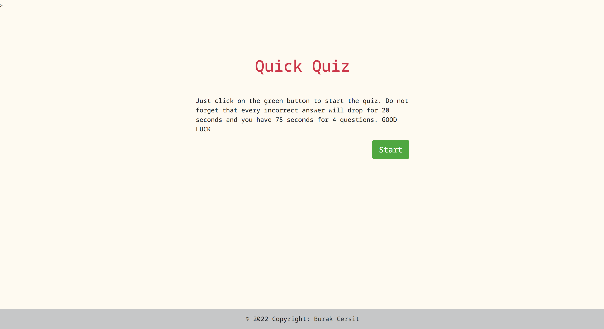

# Quiz

## Description
A quiz consisting of 4 multiple-choice questions with a 75-second countdown, deducting 20 seconds of total time for each wrong question. 

Deployed Link: https://burakcersit.github.io/Web-APIs-Code-Quiz/

Technologies used are: HTML, CSS, Javascript, JQuery, Bootstrap

## Screenshots

